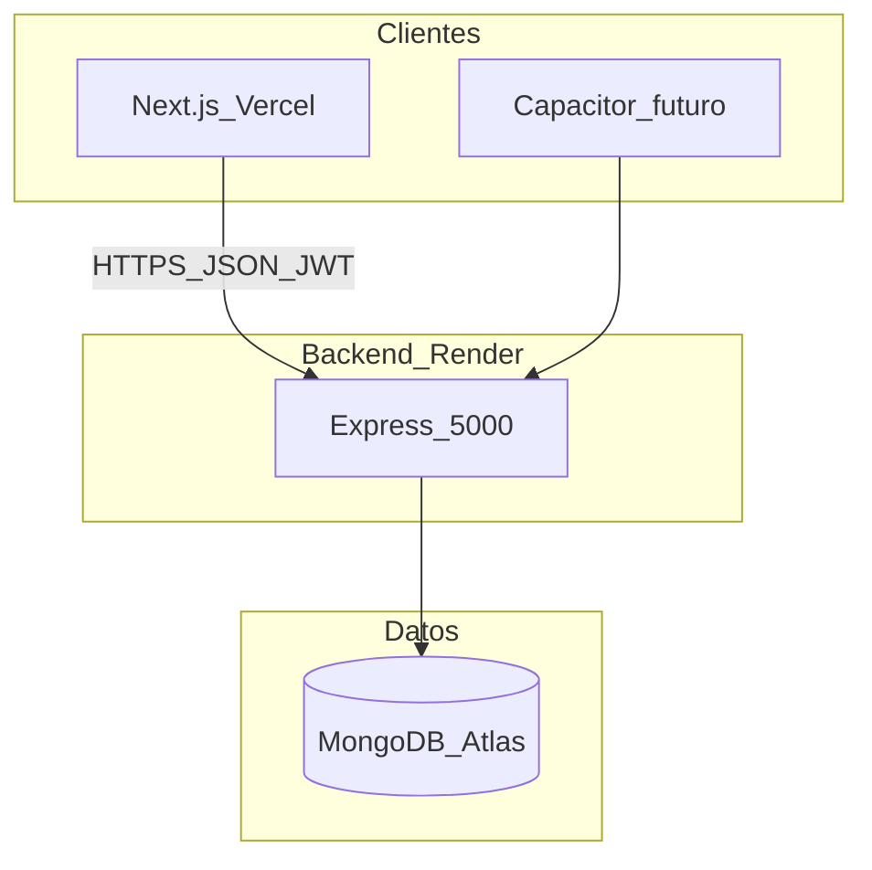

# Arquitectura

## Vista general



## Capas

| Capa | Tecnología | Responsabilidad |
|------|------------|-----------------|
| Presentación | Next.js 16 App Router | Páginas, formularios, tema claro/oscuro |
| Estado cliente | React Context (`AuthContext`, `ThemeContext`) | Sesión y preferencias |
| API | Express 5 | REST, validación, JWT, rate limit |
| Persistencia | Mongoose 9 | Modelos y consultas |
| Infra | Vercel + Render + Atlas | Hosting y BD |

## Decisiones relevantes

### Booking como fuente de verdad en itinerario

- El flujo **Me interesa** en `/travel/[id]` usa el modelo `Booking` (`POST /api/bookings`).
- `interestRequests` embebido en `Post` se **sincroniza** vía `backend/utils/bookingSync.js` para historial, reseñas y permisos de contacto.
- Rutas legacy `POST /api/posts/:id/interest` siguen disponibles por compatibilidad.

### Contacto del autor

- Teléfono/email del autor solo se exponen si el visitante es autor o participante **aprobado** (`sanitizePostForViewer`).

### Imágenes

- Fotos de perfil y vehículo en **base64** en MongoDB (límite 2 MB en body JSON). Escalable a S3/Cloudinary (ver [MEJORAS-FUTURAS.md](MEJORAS-FUTURAS.md)).

### Sin capa Repository

- Patrón directo: rutas → controladores → modelos Mongoose.

## Estructura de carpetas clave

```
backend/
  config/db.js
  controllers/
  middleware/
  models/
  routes/
  utils/bookingSync.js
  utils/cronJobs.js

web/src/
  app/           # Rutas App Router
  components/
  context/
  lib/api.js     # Cliente Axios
```

## Seguridad

- Helmet, compression, rate limit en `/api/`
- CORS con lista explícita (localhost, `FRONTEND_URL`, URLs Vercel)
- JWT en header `Authorization: Bearer`
- `optionalAuth` en `GET /api/posts/:id` para sanitizar contacto según sesión
