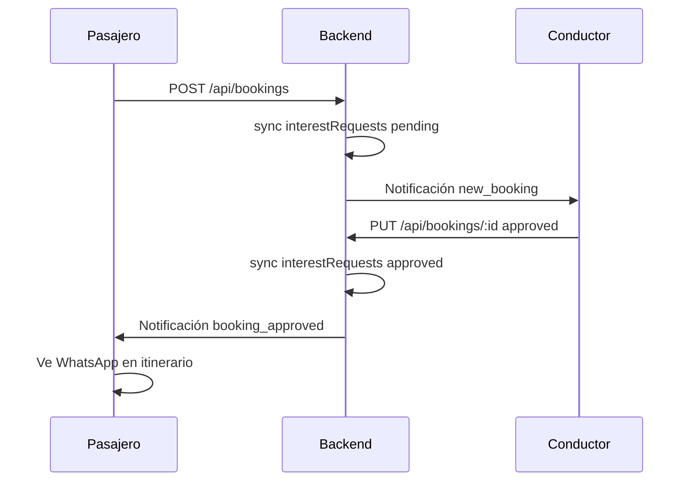

# Flujo del sistema

## 1. Registro e inicio de sesión

1. Usuario se registra en `/register` → `POST /api/auth/register`.
2. Login en `/login` → `POST /api/auth/login` → token JWT guardado en `localStorage`.
3. `AuthContext` carga perfil con `GET /api/auth/me`.

## 2. Publicar viaje

| Tipo | Pantalla | Requisitos extra |
|------|----------|------------------|
| **Ofrecer** (`type: offer`) | `/publish` | Foto de perfil real, vehículo registrado |
| **Buscar** (`type: request`) | `/publish` | Formulario más simple |

Flujo API: `POST /api/posts` (autenticado, validación express-validator).

## 3. Buscar y ver itinerario

1. `/search` lista publicaciones activas → `GET /api/posts?origin=&destination=&...`
2. Tarjeta → **Ver detalle** → `/travel/[id]`
3. `GET /api/posts/:id` devuelve ruta, mapa, datos del autor (contacto oculto hasta aprobación).

## 4. Me interesa (reservas)

- Pasajero completa modal y envía solicitud.
- Conductor ve lista en itinerario → Aprobar / Rechazar.
- Tras aprobación: enlace WhatsApp visible para ambos.

## 5. Mis publicaciones y solicitudes

- `/my-posts` — publicaciones propias + contador de `interestRequests`
- `/my-bookings` — solicitudes enviadas (`GET /api/bookings/my-requests`)

## 6. Historial y calificaciones

- `/history` — viajes **completados**, separados en:
  - **Ofreciste / Conduciste** (`offered`)
  - **Buscaste / Viajaste** (`joined`)
- Fuente: `GET /api/users/me/history` (usa `interestRequests` aprobados, alineados con Booking).
- Calificaciones: `POST /api/reviews` solo entre conductor ↔ pasajero del mismo viaje completado.

## 7. Vehículos

- `/my-vehicles` — CRUD ` /api/vehicles` (patente, VTV, foto en base64).

## 8. Notificaciones

- Campana en navbar → `GET /api/notifications`, marcar leídas.

## 9. Reportes

- Botón en itinerario (UI); API `POST /api/reports` para persistencia formal.

## 10. Legal

Páginas estáticas: términos, privacidad, reglas de convivencia. Textos legales no deben alterarse sin revisión legal.

## Estados de un viaje (`Post.status`)

| Estado | Significado |
|--------|-------------|
| `active` | Visible en búsqueda, acepta solicitudes |
| `completed` | Finalizado; habilita reseñas en historial |
| `cancelled` | Baja lógica |
