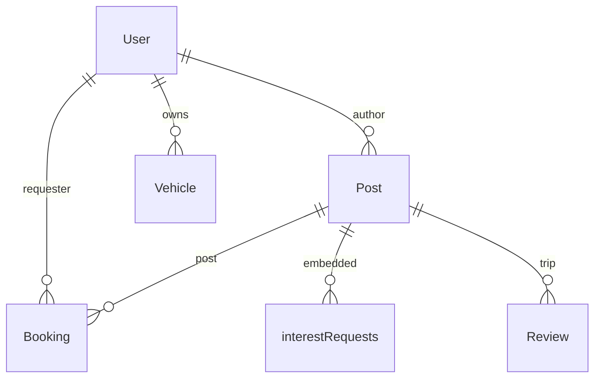

# Base de datos (MongoDB)

## Modelos

### User

- Credenciales, `name`, `phone`, `profileImage` (base64 o URL)
- `role`: `user` | `admin`
- `averageRating` calculado desde reviews

### Post

| Campo | Tipo | Notas |
|-------|------|-------|
| `type` | `offer` \| `request` | Ofrecer vs buscar |
| `category` | `passenger` \| `package` | |
| `origin`, `destination` | String | |
| `departureDate` | Date | |
| `capacity` | String | Texto visible ("3 lugares") |
| `seats`, `weight` | Number | Capacidad numérica |
| `author` | ObjectId → User | |
| `status` | `active` \| `completed` \| `cancelled` | |
| `vehicle` | Mixed | ID o subdocumento embebido |
| `interestRequests[]` | Subdocs | `user`, `status`, fechas |

### Booking

- `post`, `requester`, `status`, `type` (passenger/package)
- Campos de modal: `seatsRequested`, `luggageSize`, `pets`, `weightRequested`, etc.
- **Fuente de verdad** para flujo de itinerario; sincroniza `interestRequests`

### Vehicle

- `user`, `licensePlate`, `brand`, `model`, `photoDataUrl`, `vtvExpiry`, etc.

### Review

- `author`, `recipient`, `post`, `rating`, `comment`, roles

### Notification

- `recipient`, `sender`, `type`, `message`, `link`, `read`

### Report

- Denuncias vinculadas a post/usuario

## Índices

- `Post`: texto en origin/destination/description; `{ author, status }`

## Relaciones lógicas

## Datos sensibles

- No commitear `MONGODB_URI` ni `JWT_SECRET`.
- Fotos en base64 aumentan tamaño de documentos — monitorear Atlas.
